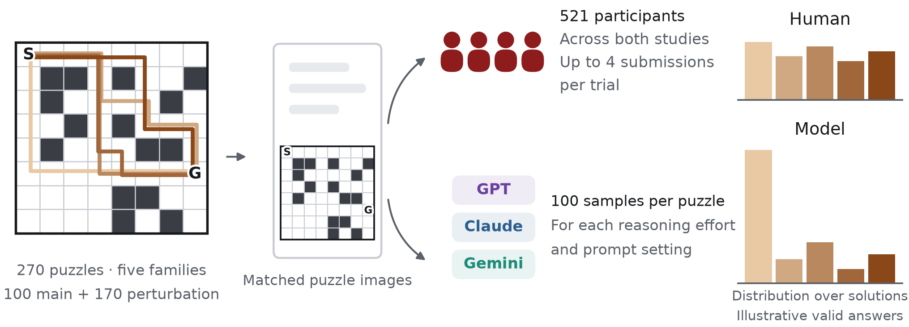
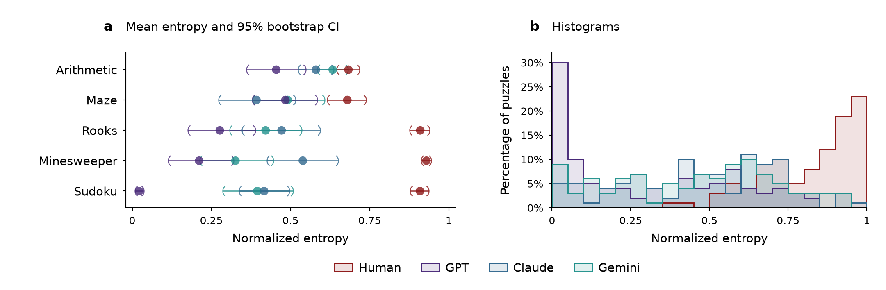

# Investigating Human–AI Discrepancies via Multiple-Solution Problems

**Zihao Wang, Francesco Insulla, and Andrea Montanari**

Frontier artificial intelligence (AI) models are benchmarked on whether they reach a correct answer. Yet many problems admit several correct answers and repeated attempts—by different people or by the same model resampled—trace out a distribution over them.

In this work, we ask whether human and model reasoning lead to different distributions over valid solutions. Our testbed comprises 270 reasoning puzzles across five puzzle families. These multiple-solution puzzles each have 3 to 8 valid solutions and are simple enough that humans and models can solve them reliably. The resulting distributions differ markedly: models differ from one another, yet resemble each other far more than they resemble humans. Model distributions are, moreover, within every puzzle family, less diverse than human ones. We compare these discrepancies across puzzle categories, and trace how they respond to reasoning-effort settings, to prompting, and to perturbations of the puzzle that leave its solutions unchanged.

Together, these results point at significant differences between human and AI problem-solving processes, and their choice among equally defensible solutions. As progressive deployment of AI systems in society comes into focus, evaluating such differences (beyond one-dimensional accuracy metrics) is increasingly important.

GPT, Claude, and Gemini refer to OpenAI GPT 5.6 Sol, Anthropic Claude Opus 4.8, and Google Gemini 3.5 Flash, respectively.

**Figure 1. General experimental procedure.** Puzzles with multiple valid solutions are presented to humans and models, and their answer distributions are compared.

**Figure 3. Entropy across puzzle families.** **a**, Mean normalized Shannon entropy across 20 puzzles per family and source. **b**, Histograms of normalized entropy for each source over the 100 main puzzles (20 per family; bins of width 0.05, y axis in percent of puzzles). Same data pipeline as for Fig. 2.

[Reproduction and collection instructions](docs/reproduction.md)
